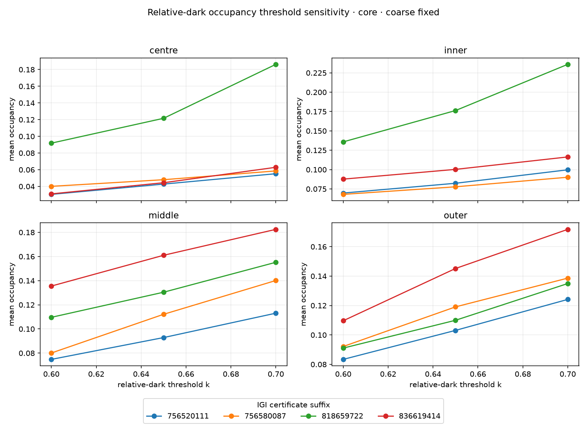

# Relative-dark occupancy benchmark

This directory completes issue #27. It validates **pixel-level relative-dark occupancy** as a descriptive recorded-image state, not as leakage, calibrated light return, fire, physical facet identity or a quality score.

## Measurement contract

For supported pixels `S_(r,t)`, the primitive is:

`O_(r,t)(k) = count[p in S_(r,t) where Y_t(p) < k * G_t] / count(S_(r,t))`.

`Y_t(p)` is encoded brightness and `G_t` is exactly the #26 fixed-common-support whole-stone median for that frame. The comparison is strict `<`: equality with `k * G_t` is not dark. The fixed global baseline is `k=0.65`; `0.60` and `0.70` are sensitivity probes only. There is no per-stone, per-region or per-representation threshold tuning.

The primary benchmark is the exact wrapped 17-frame interval `248..255,0..8` on the four complete benchmark stones. The 33-frame interval `240..255,0..16` is sensitivity only. Every available coarse/semantic × fixed/dynamic cell uses identical source frames, photometry, `G_t` and threshold.

Each per-stone/window directory commits only `occupancy.json`. The runner can also generate per-cell CSV/evidence output locally, but those redundant/heavy derived artifacts are intentionally not committed. [summary.json](summary.json) / [summary.csv](summary.csv) aggregate the threshold sweep; [dispositions.json](dispositions.json) is the machine-readable KEEP/REVISE/REJECT record. Only five representative evidence panels plus the threshold-sensitivity plot are retained in Git.

## Result: what survives

**KEEP mean occupancy on fixed coarse centre / inner / middle.** These are the cleanest regional state surfaces. The evidence panels show the intended correspondence: high-occupancy frames contain visibly more/dominant dark bands inside the declared supported region than low-occupancy frames. A representative example is [LG818659722 · core · coarse inner fixed](per-stone/IGI-LG818659722/core/evidence/coarse-inner-fixed.png).

**KEEP `k=0.65` as the operational baseline, with 0.60/0.70 as compulsory sensitivity probes.** On the core coarse-fixed mean, cross-stone rank correlation versus `k=0.65` is 1.0/0.8 for centre at `0.60/0.70`, and 1.0/1.0 for both inner and middle. The small centre change at 0.70 is a swap between close stones, not a wholesale ranking reversal.



**REJECT median occupancy as the primary scalar.** It does not add a distinct visible concept and is materially less stable in the 17→33-frame test. For fixed coarse centre/inner/middle, mean cross-stone rank correlation is 0.8 in every band; median is 0.4, -0.2 and 0.2 respectively. Q10/Q50/Q90 remain useful distribution/evidence diagnostics, but mean is the scalar handed downstream.

**REJECT dynamic support as a separate primary definition in coarse centre/inner/middle.** It is effectively a duplicate: across all four stones and core/wide windows the minimum fixed↔dynamic trace correlation is 0.998 and maximum mean difference is 0.00145. Retain dynamic output as QC/falsification, not as another descriptor.

**REVISE outer occupancy.** Outer pose/support loss changes the answer materially. LG836619414 wide coarse outer has fixed persistent support only 0.199 and fixed↔dynamic mean occupancy differs by 0.080. Threshold-induced level range for core coarse-fixed outer is also about 1.07× the baseline between-stone range (dynamic ≈1.59×), so outer fails the threshold/support robustness bar even though its rank ordering happens to stay stable in this sample. The numeric audit remains in the committed JSON; redundant outer evidence panels are intentionally not committed.

**REVISE semantic occupancy; do not replace coarse geometry yet.** A strong disagreement is [LG756580087 core coarse-middle dynamic](per-stone/IGI-LG756580087/core/evidence/coarse-middle-dynamic.png) versus [semantic-middle dynamic](per-stone/IGI-LG756580087/core/evidence/semantic-middle_step-dynamic.png), whose baseline traces are negatively correlated (≈-0.19). A low-disagreement control also exists numerically (LG818659722 wide coarse-middle fixed versus semantic-middle fixed, trace correlation ≈0.90), but its duplicate panels are not committed. Semantic support can collapse: LG836619414 wide semantic middle fixed support is 0.0076 and outer 0.0017; LG756580087 wide semantic geometry is explicitly unavailable (`no_supported_middle_outer_edge`).

A particularly strong support falsification is [LG836619414 wide semantic-middle fixed](per-stone/IGI-LG836619414/wide/evidence/semantic-middle_step-fixed.png) versus [dynamic](per-stone/IGI-LG836619414/wide/evidence/semantic-middle_step-dynamic.png): fixed support is only 0.0076 and mean occupancy differs by ≈0.081. These are QC warnings, not optical conclusions.

## Mean / threshold / window sensitivity

| coarse-fixed region | mean core→wide rank ρ | median core→wide rank ρ | mean rank ρ: 0.60 vs 0.65 | mean rank ρ: 0.70 vs 0.65 | threshold-range / baseline stone-range |
|---|---:|---:|---:|---:|---:|
| centre | 0.80 | 0.40 | 1.00 | 0.80 | 0.36 |
| inner | 0.80 | -0.20 | 1.00 | 1.00 | 0.30 |
| middle | 0.80 | 0.20 | 1.00 | 1.00 | 0.68 |
| outer | 0.80 | 0.60 | 1.00 | 1.00 | 1.07 |

The wide window changes occupancy **levels** materially because it samples a wider pose range; it does not define the primary descriptor. For the kept centre/inner/middle mean, median absolute core→wide relative change is about 30%, while cross-stone rank correlation remains 0.8 in each band. Compare occupancy only under the same declared window contract.

## Disposition

| candidate | decision | retained role |
|---|---|---|
| Coarse fixed centre / inner / middle **mean** | **KEEP** | Primary occupancy scalar + full trace |
| Coarse dynamic centre / inner / middle mean | **REJECT** as separate primary | QC/falsification; near-duplicate of fixed |
| Coarse outer mean, fixed or dynamic | **REVISE** | Candidate/QC only; support + threshold sensitivity |
| Semantic mean, fixed or dynamic | **REVISE** | Localisation experiment/QC; geometry/support unresolved |
| Median occupancy | **REJECT** as primary | Q50 remains diagnostic/evidence selector |
| Q10/Q50/Q90 | **KEEP** as diagnostics | Trace shape + deterministic evidence selection |
| `k=0.65` | **KEEP** operationally | Fixed baseline; not a calibrated truth |
| `k=0.60/0.70` | **KEEP** as probes | Mandatory sensitivity only |

The surviving state definition handed to #28 is therefore: **coarse fixed centre/inner/middle pixels, dark iff `Y_t(p) < 0.65 * G_t`, preserving the full per-frame occupancy trace and using its mean over the exact 17-frame core as the primary scalar.**

`redundancy_with_switching: pending_issue_28`. #27 does not decide whether occupancy and switching both deserve to survive; #28 should test whether switching adds distinct visible temporal information on top of this state definition.

## Validity and limits

Two stones inherit upstream segmentation review reasons from the common pipeline. Semantic review/unavailable states remain semantic-only and do not contaminate coarse occupancy. Missing/unobserved frames remain null and do not enter persistent-support intersections. No NaN/Infinity is serialized.

This sample is four stones and mixes source pipelines. It establishes a reproducible measurement contract and falsifies weak formulations; it does not establish population thresholds or any purchase/quality interpretation.

## Reproduce

The 256-frame source ZIPs are GitHub Release assets indexed by [../benchmark/source-bundles.json](../benchmark/source-bundles.json). Follow [../benchmark/README.md](../benchmark/README.md) to download and verify them. Preprocess with gain `1.0` and explicit `accept_review=True`, run `diamond360.asscher_steps` on the exact requested interval, then call `diamond360.occupancy_benchmark.measure_stone` / `write_stone_outputs`.

Run repository validation with:

```bash
python -m unittest discover -s tests -v
```


## Repository-size policy

The benchmark runner deliberately generates exhaustive per-cell evidence for local audit, but Git retains only the smallest representative subset needed to support the disposition: one visibly interpretable kept example, one coarse↔semantic disagreement pair, one fixed↔dynamic support disagreement pair, and the threshold-sensitivity plot. Reproduce the full evidence set locally when needed; do not commit it by default.
